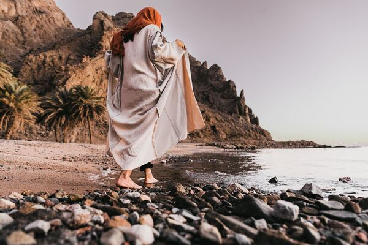

Just a small example of how to use Vertex AI's image captioning.

Reference: [Get image descriptions using visual captioning](https://cloud.google.com/vertex-ai/docs/generative-ai/image/image-captioning)



The image is from Unsplash. 

I checked the time it takes to generate captions for different image sizes. The results are shown below. The elapsed time includes time to upload and time to process. The elaplsed time difference should be mostly because of the processing. The image size is in kilo bytes and the upload time are not much different between the images.

```
Captions for beach_600x400.jpg:
Elapsed time: 2510ms
[
  'a woman is walking barefoot on a rocky beach near the ocean .',
  'a woman in a hijab is walking barefoot on a rocky beach near the ocean .',
  'a woman in a hijab is walking barefoot on a rocky beach .'
]

Captions for beach_1200x800.jpg:
Elapsed time: 3638ms
[
  'a woman in a white robe is walking barefoot on a rocky beach',
  'a woman walking barefoot on a rocky beach near the water',
  'a woman in a white robe stands on a rocky beach near the water'
]

Captions for beach_2376x1584.jpg:
Elapsed time: 7485ms
[
  'a woman in a white robe is walking barefoot on a rocky beach',
  'a woman in a white robe stands on a rocky beach near the water',
  'a woman in a white robe is standing on a rocky beach near the water'
]
```